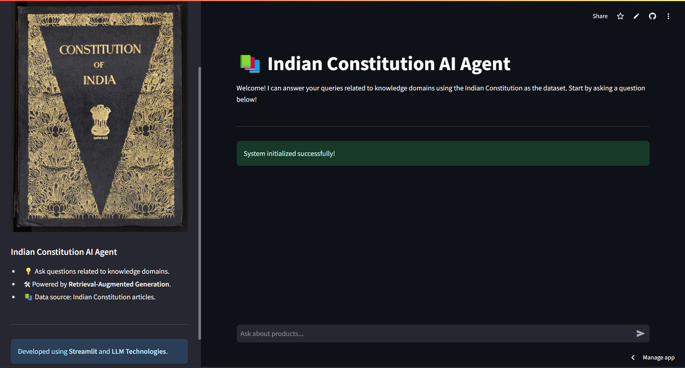

---

# IndianConstitutionRAG

IndianConstitutionRAG is a project that utilizes Retrieval-Augmented Generation (RAG) techniques to provide insights and information about the Constitution of India. It offers an interactive platform for users to explore constitutional content efficiently.

---

## Features

- **Interactive Exploration**: Engage with the Constitution of India through a user-friendly interface.
- **Advanced Retrieval**: Employs RAG techniques to fetch relevant information promptly.
- **Real-time Responses**: Delivers accurate answers to user queries about constitutional provisions.


---

## Installation

1. **Clone the Repository**:

   ```bash
   git clone https://github.com/ASIF-Kh/IndianConstitutionRAG.git
   cd IndianConstitutionRAG
   ```

2. **Set Up the Environment**:

   - Ensure you have Python installed (preferably version 3.8 or above).
   - Create a virtual environment:

     ```bash
     python -m venv env
     source env/bin/activate  # On Windows: env\Scripts\activate
     ```

3. **Install Dependencies**:

   ```bash
   pip install -r requirements.txt
   ```

4. **Configure Environment Variables**:

   - Rename `sample.env` to `.env`.
   - Update the `.env` file with necessary configurations.

---

## Usage

1. **Data Ingestion**:

   ```bash
   python ingestion.py
   ```

   This script processes and prepares the constitutional data for retrieval.

2. **Run the Application**:

   ```bash
   python deploy.py
   ```

   Access the application at `http://localhost:8501` in your web browser.

  
*Screenshot of the running application.*

---

## Contributing

Contributions are welcome! Please fork the repository and create a pull request with your enhancements or bug fixes.

---

## License

This project is licensed under the MIT License. See the [LICENSE](LICENSE) file for more details.

---

## Acknowledgements

Special thanks to the contributors and the open-source community for their invaluable support.

---

## Live Demo

Visit the live application: [bharat.streamlit.app](https://bharat.streamlit.app/)  

  
*Screenshot of the live demo.*

---
